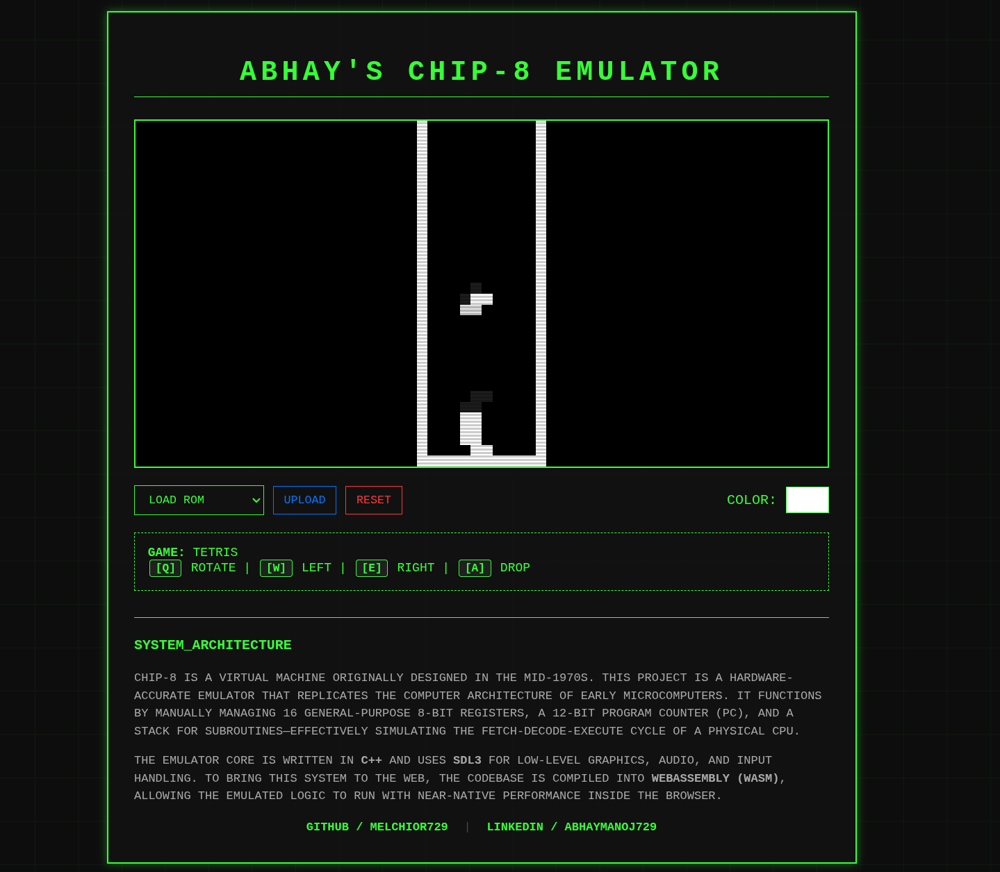

# Abhay's Chip8 Emulator

A CHIP-8 emulator written in C++, rendered with SDL3, and compiled to WebAssembly so it can run directly in the browser.



Live demo: [https://chip8-emulator-seven.vercel.app/](https://chip8-emulator-seven.vercel.app/)

## Overview

This project is a browser-playable implementation of the classic CHIP-8 virtual machine. The emulator core is written in modern C++ and models the main parts of the original system: memory, registers, stack, timers, keypad input, sprite rendering, and the fetch-decode-execute cycle. The native rendering and audio layer uses SDL3, and the same codebase is compiled with Emscripten to WebAssembly for deployment on the web. The test suite is implemented using the GTest (GoogleTest) library.

The web build includes a retro terminal-style interface, ROM selection, custom ROM upload support, reset controls, and a color picker that changes the display color through a JavaScript-to-Wasm bridge.

## Features

-   CHIP-8 CPU core implemented in C++
    
-   Browser deployment using WebAssembly
    
-   SDL3-based graphics, audio, and input handling
    
-   ROM selection from bundled games
    
-   Custom ROM upload in the browser
    
-   Adjustable draw color from the web UI
    
-   Built-in test suite using GoogleTest
    
-   Included sample ROMs:
    
    -   IBM test
        
    -   Breakout
        
    -   Flight Runner
        
    -   Pong
        
    -   Tetris
        

## Project Structure

## Project Structure

```text
chip8-emulator/
├── imgs/
│   └── example.png
├── roms/
│   ├── breakout.ch8
│   ├── flight-runner.ch8
│   ├── ibm.ch8
│   ├── pong.ch8
│   └── tetris.ch8
├── src/
│   ├── core/
│   │   ├── chip8.cpp
│   │   └── chip8.hpp
│   └── main.cpp
├── tests/
│   ├── chip8_test.cpp
│   └── CMakeLists.txt
├── web/
│   ├── index.html
│   ├── index.js
│   ├── index.wasm
│   ├── main.js
│   └── styles.css
├── build.sh
├── CMakeLists.txt
└── LICENSE
```

## Tech Stack

-   C++20
    
-   SDL3
    
-   Emscripten
    
-   WebAssembly
    
-   GoogleTest
    
-   CMake
    

## How the Emulator Works

### CHIP-8 Architecture

The emulator models the major components of a CHIP-8 system:

-   Memory: 4096 bytes
    
-   Program start address: 0x200
    
-   Registers: 16 general-purpose 8-bit registers, V0 through VF
    
-   Index register: I
    
-   Program counter: PC
    
-   Stack: 16 levels for subroutine calls
    
-   Stack pointer: SP
    
-   Delay timer: DT
    
-   Sound timer: ST
    
-   Display: 64 × 32 monochrome pixels
    
-   Keypad: 16-key hexadecimal input system
    

### Memory Layout

The emulator stores CHIP-8 state in fixed-size arrays. Programs are loaded starting at address 0x200, which is the standard CHIP-8 entry point. Font sprite data is stored in low memory and loaded during reset.

The `load_into_memory()` function copies ROM contents into memory starting at 0x200.

### Registers

The CPU contains V0 to VF general-purpose registers. VF is also used as a flag register for certain instructions such as carry, borrow, and collision detection. The I register stores memory addresses used by many instructions. PC tracks the current instruction address, and SP tracks the top of the stack.

### Program Counter

The program counter starts at 0x200. During each CPU cycle, the current 2-byte opcode is fetched from memory at PC, then PC is advanced by 2, and then the instruction is decoded and executed. Some instructions modify PC again, such as jumps, calls, returns, and skip instructions.

This matches the standard CHIP-8 execution model.

### Fetch-Decode-Execute Cycle

The `cycle()` function performs one CPU step.

It checks whether the emulator is waiting for a key press, fetches the current opcode, increments the program counter, decodes the opcode into nibbles and operands, and dispatches execution to the appropriate instruction handler.

The opcode decoder extracts the opcode type, register indices x and y, nibble n, byte nn, and address nnn.

### Stack and Subroutines

Subroutine calls push the current return address onto the stack and increase SP. Returns pop the last address from the stack and restore PC.

Implemented instructions include:

-   2NNN — call subroutine
    
-   00EE — return from subroutine
    

### Display Rendering

The display is represented as a flat array of 64 × 32 pixels. Sprites are drawn using XOR logic, which is how CHIP-8 traditionally handles graphics.

The `draw()` instruction reads sprite bytes from memory starting at I, draws them at `(Vx, Vy)`, wraps around screen edges, and sets VF = 1 if any pixels are erased during XOR drawing, indicating a collision.

In the SDL layer, active pixels are converted into rectangles and rendered to the window. The browser canvas is driven by the WebAssembly build.

### Timers

The emulator supports a delay timer and a sound timer.

In the application loop, if DT is greater than 0, it is decremented. If ST is greater than 0, audio data is pushed to the SDL audio stream and ST is decremented.

### Sound

The project generates a square-wave style tone using floating-point audio samples. When the sound timer is non-zero, the emulator outputs the generated waveform through SDL audio.

### Input Handling

The CHIP-8 keypad is mapped to the keyboard like this:

| CHIP-8 | Keyboard |
|------|---------|
| 1 2 3 C | 1 2 3 4 |
| 4 5 6 D | Q W E R |
| 7 8 9 E | A S D F |
| A 0 B F | Z X C V |

The browser UI also displays control hints for bundled ROMs.

### Font Data

The emulator stores built-in sprite data for hexadecimal characters 0 through F. Each character is 5 bytes tall, and the FX29 instruction points I to the correct sprite address for the digit stored in a register.

## Implemented Instruction Groups

The emulator includes handlers for the main CHIP-8 opcode families, including screen clear and return, jumps and subroutine calls, conditional skips, register loads and arithmetic, bitwise operations, shifts, random number masking, sprite drawing, keypad-based skips, delay and sound timer access, wait-for-key input, index register updates, sprite lookup, BCD conversion, and register-memory transfer operations.

## Web Frontend

The web interface is built around the generated WebAssembly module and a custom HTML, CSS, and JavaScript frontend.

### Frontend Features

-   ROM dropdown selector
    
-   file upload for custom ROMs
    
-   reset button
    
-   display color picker
    
-   game-specific control hints
    
-   retro terminal visual styling
    

### JavaScript / Wasm Bridge

A C++ function named `set_draw_color()` is exported using `EMSCRIPTEN_KEEPALIVE`. The frontend color picker converts a hex color to RGB and passes those values into the Wasm module so the emulator can update the pixel draw color at runtime.

### Custom ROM Uploads

When a user uploads a ROM, the browser reads the file as bytes, stores the bytes in sessionStorage, and on reload Emscripten’s virtual filesystem writes those bytes to `upload.ch8`. The emulator then boots using that uploaded ROM.

## Controls

### Global Browser Controls

-   Load ROM: choose a bundled ROM
    
-   Upload: load a local `.ch8` file
    
-   Reset: restart the current session
    
-   Color: change display color
    

### CHIP-8 Keyboard Layout

| CHIP-8 |
|------|
| 1 2 3 C |
| 4 5 6 D |
| 7 8 9 E||
| A 0 B F |

### Bundled ROM Hints

-   IBM Test: no controls
    
-   Breakout: [Q] left, [E] right
    
-   Flight Runner: [W] ascend, [S] descend
    
-   Pong: [1] up, [Q] down
    
-   Tetris: [Q] rotate, [W] left, [E] right, [A] drop
    

## Testing

The emulator core is tested with GoogleTest. The test suite focuses on opcode behavior and CPU state changes.

### What the Tests Cover

The provided tests verify behavior such as font data loading, system jump behavior, screen clearing, subroutine call and return, direct jumps, conditional skip instructions, register loads, register-byte addition, register-to-register copy, bitwise OR, AND, XOR, addition with carry into VF, subtraction and borrow behavior, left and right shifts, index register loading, jump with V0 offset, masked random number generation, sprite drawing and screen wrapping, sprite collision detection, keypad-based skipping, delay timer loads, blocking for key input, setting delay and sound timers, I += Vx, font sprite lookup, binary-coded decimal conversion, and register-to-memory and memory-to-register transfer.

These tests are useful because the CHIP-8 core is deterministic and instruction-based, which makes it a very good fit for unit testing.

## Building the Project

### Native Build with CMake

You will need a C++20 compiler, CMake, SDL3, and GoogleTest.

Example build flow:

```
Bash

cmake -B build
cd build
cmake --build .
```

Depending on your local environment and SDL3 installation, you may need to install SDL3 development packages first.

## Running Tests

After configuring the project with CMake:

```
Bash

cd build/tests
./run_tests
```

Or run the test binary directly if it is generated by your build system.

## Building the WebAssembly Version

The project includes a `build.sh` script that uses Emscripten:

```
Bash

#!/bin/bash  
  
mkdir -p web  
  
emcc src/main.cpp src/core/chip8.cpp 
  -Isrc/core 
  -o web/index.js
  -sUSE_SDL=3  
  --embed-file roms/ 
  -sALLOW_MEMORY_GROWTH=1 
  -std=c++20  
  -O0
  -DSDL_MAIN_USE_CALLBACKS=1
```

### Web Build Notes

`--embed-file roms/` packages the ROM folder into the virtual filesystem. `-sUSE_SDL=3` enables SDL3 support in the Emscripten build. `-sALLOW_MEMORY_GROWTH=1` allows the Wasm memory allocation to expand. The output files are emitted into the `web/` folder.

To build the web version, run:

```
Bash

chmod +x build.sh  
./build.sh
```

## Running Locally in the Browser

After generating the web build, serve the `web/` folder through a local HTTP server. For example:

```
Bash

cd web  
python3 \-m http.server 8000
```

Then open the local server in your browser.

## Design Notes

A major goal of this project is to keep the emulator core separate from the platform-specific interface layer.

`src/core/chip8.hpp` and `src/core/chip8.cpp` contain the CPU and machine state. `src/main.cpp` handles SDL windowing, rendering, audio, ROM loading, and input. `web/index.html`, `web/main.js`, and `web/styles.css` provide the browser UI around the WebAssembly build.

This separation makes the emulator easier to test, extend, and port.

## What I Learned

This project required combining low-level systems concepts with practical software tooling: modeling a virtual machine in C++, implementing instruction decoding, managing memory and registers directly, rendering a pixel display manually, mapping host keyboard input to virtual keypad input, generating audio output, writing unit tests for low-level CPU behavior, and compiling native C++ code to WebAssembly for browser execution.

## Author

Abhay Manoj

-   GitHub: [https://github.com/melchior729](https://github.com/melchior729)
    
-   LinkedIn: [https://linkedin.com/in/abhaymanoj729](https://linkedin.com/in/abhaymanoj729)
    
## License

This repository includes a `LICENSE` file. See that file for the exact license terms.
