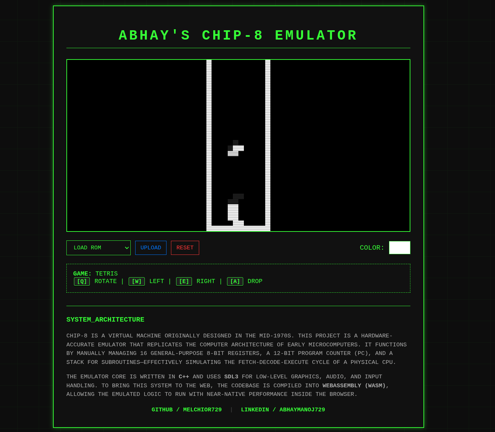

# Abhay's CHIP-8 Emulator

A from-scratch **CHIP-8 emulator** written in modern C++20. It implements the virtual machine's fetch-decode-execute loop, memory, registers, stack, timers, keypad, 64×32 display, and buzzer, with SDL3 providing graphics, input, and audio.

The same emulator runs as a native desktop application and in the browser through WebAssembly, where a retro terminal-style interface supports bundled games, custom ROM uploads, reset controls, and selectable display colors.



---

## Table of Contents

- [Features](#features)
- [Architecture Overview](#architecture-overview)
- [CHIP-8 Architecture](#chip-8-architecture)
- [Emulation Loop](#emulation-loop)
- [Dependencies](#dependencies)
- [Building](#building)
  - [Native (Desktop)](#native-desktop)
  - [Web (WebAssembly)](#web-webassembly)
- [Running](#running)
- [Controls](#controls)
- [Web Interface](#web-interface)
- [Uploading Custom ROMs](#uploading-custom-roms)
- [Bundled ROMs](#bundled-roms)
- [Testing](#testing)
- [Configuration](#configuration)
- [Project Structure](#project-structure)
- [Implementation Notes](#implementation-notes)
- [License](#license)
- [Author](#author)

---

## Features

- **C++20 CHIP-8 core** with a complete fetch-decode-execute cycle
- **Classic CHIP-8 machine state**:
  - 4 KB memory
  - 16 general-purpose 8-bit registers (`V0`–`VF`)
  - 16-level call stack
  - 12-bit address space with programs loaded at `0x200`
  - 64×32 monochrome display
  - 16-key hexadecimal keypad
- **Opcode support** for arithmetic, bitwise operations, jumps, subroutines, drawing, input, timers, BCD conversion, and memory transfers
- **Sprite collision detection** through the `VF` flag
- **Delay and sound timers** updated at 60 Hz
- **432 Hz square-wave buzzer** while the sound timer is active
- **SDL3 rendering** scaled to a 1024×512 desktop window
- **Native and browser targets** from the same C++ emulator core
- **WebAssembly frontend** built with Emscripten and SDL3
- **Bundled ROM selector** for IBM Logo, Breakout, Flight Runner, Pong, and Tetris
- **Custom ROM uploads** stored in browser session storage
- **Customizable display color** through a JavaScript-to-Wasm bridge
- **Automated opcode tests** built with GoogleTest

---

## Architecture Overview

```text
┌──────────────────────────────────────────────────────────────┐
│                      Application Layer                       │
│  src/main.cpp                                                │
│  SDL3 callbacks, ROM loading, rendering, audio, and input     │
└──────────────────────────────┬───────────────────────────────┘
                               │
┌──────────────────────────────▼───────────────────────────────┐
│                       Emulator Core                          │
│  src/chip8.hpp / src/chip8.cpp                               │
│  CPU state, memory, opcode decoding, timers, and display      │
└──────────────────────────────┬───────────────────────────────┘
                               │
             ┌─────────────────┴─────────────────┐
             │                                   │
┌────────────▼─────────────┐       ┌─────────────▼─────────────┐
│      Native Frontend     │       │       Web Frontend        │
│  SDL3 desktop window     │       │  Emscripten + WebAssembly │
│  Keyboard and audio      │       │  HTML, CSS, and JavaScript│
└──────────────────────────┘       └───────────────────────────┘
```

The project is divided into three main parts:

1. **`Chip8` core** — owns all emulated machine state and executes instructions independently of the frontend.
2. **SDL3 application** — loads ROMs, maps keyboard input to the CHIP-8 keypad, draws the display buffer, and generates sound.
3. **Web shell** — selects or uploads ROMs, configures the Emscripten module, and exposes browser controls around the SDL canvas.

---

## CHIP-8 Architecture

The `Chip8` class models the following virtual hardware:

| Component | Size / Value | Purpose |
|-----------|--------------|---------|
| Memory | 4096 bytes | Instructions, sprites, and program data |
| Program start | `0x200` | First address available to loaded ROMs |
| Registers | 16 × 8-bit | General-purpose registers `V0`–`VF` |
| Index register | 16-bit | Stores memory addresses in `I` |
| Program counter | 16-bit | Points to the next instruction |
| Stack | 16 × 16-bit | Stores subroutine return addresses |
| Stack pointer | 8-bit | Tracks the active stack level |
| Display | 64×32 pixels | Monochrome XOR-based graphics buffer |
| Keypad | 16 keys | Hexadecimal input from `0` through `F` |
| Delay timer | 8-bit | Counts down at 60 Hz |
| Sound timer | 8-bit | Counts down at 60 Hz and enables the buzzer |

The built-in hexadecimal font sprites are loaded at the beginning of memory when the emulator is initialized.

---

## Emulation Loop

SDL3 calls `SDL_AppIterate()` once per frame. Each iteration:

1. Clears the SDL renderer to black.
2. Decrements the delay timer when it is nonzero.
3. Queues one frame of square-wave audio and decrements the sound timer when it is nonzero.
4. Executes **10 CHIP-8 CPU cycles**.
5. Reads the 64×32 display buffer.
6. Draws each active CHIP-8 pixel as a 16×16 SDL rectangle.
7. Presents the completed frame with VSync enabled.

Each CPU cycle in the emulator core:

```text
Fetch 16-bit instruction from memory at PC
                  │
                  ▼
       Advance PC to next instruction
                  │
                  ▼
 Decode opcode, registers, address, byte, and nibble
                  │
                  ▼
       Execute the matching CHIP-8 operation
```

Sprite drawing uses XOR semantics: drawing over an active pixel clears it, and `VF` is set when a collision occurs.

---

## Dependencies

### Native Build

| Dependency | Purpose |
|------------|---------|
| **C++20 compiler** | Builds the emulator core and SDL application |
| **CMake 3.28+** | Configures native and test targets |
| **SDL3** | Windowing, rendering, audio, and keyboard input |
| **GoogleTest** | Builds and runs the opcode test suite |

### Web Build

| Dependency | Purpose |
|------------|---------|
| **Emscripten (`emcc`)** | Compiles C++ and SDL3 to JavaScript/WebAssembly |
| **Python 3** or another static server | Serves the web build locally |

No JavaScript package manager or backend server is required.

---

## Building

### Native (Desktop)

SDL3 and GoogleTest must be installed and discoverable by CMake.

```bash
cmake -S . -B build
cmake --build build
```

The native executable is written to:

```text
build/chip8
```

The build uses C++20 with compiler extensions disabled and defines `SDL_MAIN_USE_CALLBACKS` for SDL3's callback-based application lifecycle.

### Web (WebAssembly)

Install and activate the Emscripten SDK so that `emcc` is available, then run:

```bash
./build.sh
```

The script:

- Compiles `src/main.cpp` and `src/chip8.cpp`
- Enables Emscripten's SDL3 port
- Embeds the entire `roms/` directory in the virtual filesystem
- Enables WebAssembly memory growth
- Generates `web/index.js` and `web/index.wasm`

The current web build uses `-O0`, which favors debuggability over runtime and download-size optimization.

---

## Running

### Native

Pass exactly one ROM path to the executable:

```bash
./build/chip8 roms/tetris.ch8
```

General usage:

```text
chip8 <rom-path>
```

If the ROM cannot be opened, or the argument is omitted, the application exits with an error.

### Web

WebAssembly files should be served over HTTP rather than opened directly from the filesystem:

```bash
cd web
python3 -m http.server 8080
```

Then open:

```text
http://localhost:8080/
```

Tetris loads by default. A bundled ROM can also be selected through a query parameter:

```text
http://localhost:8080/?rom=roms/pong.ch8
```

---

## Controls

The physical keyboard is mapped to the CHIP-8 hexadecimal keypad as follows:

```text
CHIP-8 keypad                 Computer keyboard
┌───┬───┬───┬───┐            ┌───┬───┬───┬───┐
│ 1 │ 2 │ 3 │ C │            │ 1 │ 2 │ 3 │ 4 │
├───┼───┼───┼───┤            ├───┼───┼───┼───┤
│ 4 │ 5 │ 6 │ D │            │ Q │ W │ E │ R │
├───┼───┼───┼───┤            ├───┼───┼───┼───┤
│ 7 │ 8 │ 9 │ E │            │ A │ S │ D │ F │
├───┼───┼───┼───┤            ├───┼───┼───┼───┤
│ A │ 0 │ B │ F │            │ Z │ X │ C │ V │
└───┴───┴───┴───┘            └───┴───┴───┴───┘
```

### Bundled Game Controls

| ROM | Controls |
|-----|----------|
| **IBM Logo** | No controls |
| **Breakout** | `Q` left, `E` right |
| **Flight Runner** | `W` ascend, `S` descend |
| **Pong** | `1` up, `Q` down |
| **Tetris** | `Q` rotate, `W` left, `E` right, `A` drop |

Custom ROMs use the full keyboard mapping shown above.

---

## Web Interface

The browser interface in `web/` provides:

- **ROM selector** — reloads the emulator with one of the bundled programs
- **Upload button** — loads a local CHIP-8 ROM without sending it to a server
- **Reset button** — restarts the active bundled ROM or returns from an uploaded ROM to the default
- **Color picker** — changes the color used for active display pixels
- **Per-game instructions** — shows the controls expected by each bundled ROM
- **Focusable SDL canvas** — forwards browser keyboard events to the emulator

JavaScript configures the Emscripten `Module` before the generated runtime starts:

```text
web/main.js
    │
    ├── Module.arguments ─────────► native-style ROM path argument
    ├── Module.preRun ────────────► writes uploaded ROM to MEMFS
    └── Module._set_draw_color() ─► updates C++ rendering state
```

The C++ function `set_draw_color(r, g, b)` is exported with `EMSCRIPTEN_KEEPALIVE` and called directly from the color picker.

---

## Uploading Custom ROMs

1. Open the web interface.
2. Click **UPLOAD**.
3. Select a CHIP-8 ROM from your computer.
4. The page reloads and starts the uploaded program.

The selected file is read as raw bytes and stored in `sessionStorage` under `custom_rom_bytes`. Before the Wasm application starts, `Module.preRun` writes those bytes to Emscripten's in-memory filesystem as:

```text
upload.ch8
```

The browser then passes that path to the same ROM-loading code used by the native build. Uploaded data remains local to the current browser tab's session.

> ROM compatibility can vary because CHIP-8 programs sometimes depend on interpreter-specific opcode quirks.

---

## Bundled ROMs

| ROM | File | Description |
|-----|------|-------------|
| **IBM Logo** | `roms/ibm.ch8` | Static CHIP-8 graphics test |
| **Breakout** | `roms/breakout.ch8` | Paddle-and-block game |
| **Flight Runner** | `roms/flight-runner.ch8` | Side-scrolling avoidance game |
| **Pong** | `roms/pong.ch8` | One-player paddle game |
| **Tetris** | `roms/tetris.ch8` | Falling-block puzzle game and web default |

These files are loaded directly from disk in native builds and embedded into the WebAssembly virtual filesystem by `build.sh`.

---

## Testing

The test suite uses GoogleTest and covers instruction decoding and individual CHIP-8 operations, including:

- Flow control and subroutines
- Register loads and comparisons
- Arithmetic, carry, and borrow behavior
- Bitwise and shift operations
- Random masking
- Sprite rendering and collision flags
- Keyboard input
- Delay and sound timers
- Font sprite lookup
- BCD conversion
- Register and memory transfers

Build and run the test executable:

```bash
cmake -S . -B build
cmake --build build --target run_tests
./build/tests/run_tests
```

Although the root build enables testing, the current CMake files do not register `run_tests` with `add_test()`, so run the executable directly instead of relying on `ctest`.

---

## Configuration

Core runtime values are defined in `src/chip8.hpp` and `src/main.cpp`:

| Setting | Value | Location |
|---------|-------|----------|
| CHIP-8 memory | 4096 bytes | `Chip8::MEMORY_SIZE` |
| Program start | `0x200` | `Chip8::START` |
| Display resolution | 64×32 | `Chip8::WIDTH`, `Chip8::HEIGHT` |
| Display scale | 16× | `SCALING_FACTOR` |
| SDL window size | 1024×512 | Derived from resolution and scale |
| Stack depth | 16 | `Chip8::STACK_SIZE` |
| Register count | 16 | `Chip8::REGISTER_COUNT` |
| Buzzer frequency | 432 Hz | `Chip8::FREQUENCY` |
| Frame rate | 60 Hz | `FRAME_RATE` |
| CPU cycles per frame | 10 | `CYCLES_PER_FRAME` |
| Audio sample rate | 48 kHz | `SAMPLE_RATE` |
| Default pixel color | `#ffffff` | `AppState` / web color picker |
| Default web ROM | Tetris | `web/main.js` |

There are no environment variables or external runtime configuration files.

---

## License

This project is licensed under the [MIT License](LICENSE).

Copyright © 2026 Abhay Manoj.

---

## Author

**Abhay Manoj**

- GitHub: [github.com/melchior729](https://github.com/melchior729)
- LinkedIn: [linkedin.com/in/abhaymanoj729](https://linkedin.com/in/abhaymanoj729)
